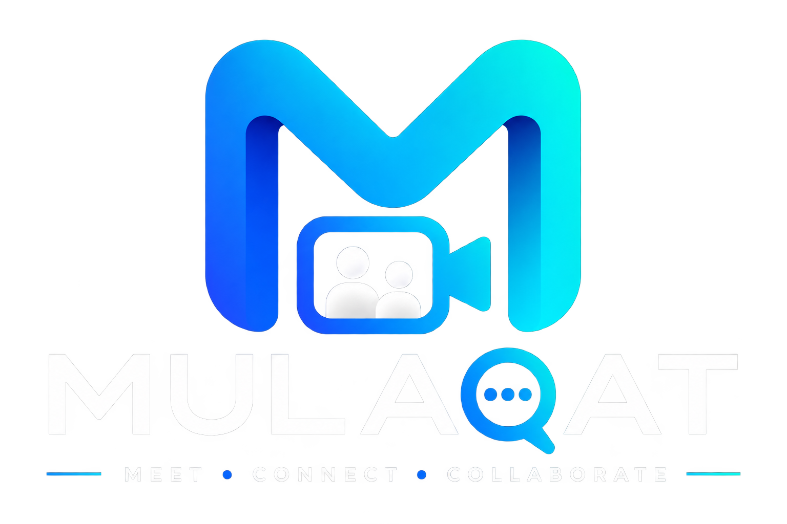

Real-Time Video Conferencing Platform

A full-stack web application for secure, interactive online meetings with
multi-user video, real-time chat, screen sharing, authentication, and meeting management.

  
  
  
  
  

✨ What is Mulaqat?

Mulaqat is a full-stack real-time video conferencing platform built from scratch using modern web technologies.

It combines WebRTC for peer-to-peer media communication with Socket.IO for real-time signaling and communication, while a Node.js/Express + MongoDB backend handles authentication, meetings, users, and account management.

The goal is simple: provide a complete meeting experience inside one application — from authentication and meeting creation to live video, chat, screen sharing, and meeting history.

🚀 Features

🔐 Authentication

User registration and login

JWT-based authentication

Google OAuth authentication

Forgot password flow

Email-based password reset

Protected API routes

Secure logout

🎥 Real-Time Meetings

Create meetings

Join meetings using Meeting ID

Multi-user video conferencing

WebRTC peer-to-peer media communication

Real-time Socket.IO signaling

Participant join/leave handling

Host-controlled meeting termination

Meeting-ended state for participants

💬 Real-Time Chat

Live meeting chat

Socket.IO powered messaging

Message validation

Room-based message delivery

🖥️ Screen Sharing

Start/stop screen sharing

Real-time screen-share stream replacement

Automatic restoration of camera stream

🕘 Meeting History

View previous meetings

Meeting status tracking

Meeting creation/end timestamps

Delete meeting history

⚙️ Account Settings

Update profile name

Update profile photo

Use Google profile photo

Change email with OTP verification

Change password with old-password verification

Delete account

🧠 How It Works

                         ┌──────────────────────┐
                         │       MULAQAT        │
                         │      Frontend        │
                         │    React + Vite      │
                         └──────────┬───────────┘
                                    │
                    ┌───────────────┼────────────────┐
                    │               │                │
                    ▼               ▼                ▼
               REST API        Socket.IO          WebRTC
                    │               │                │
                    ▼               ▼                ▼
             ┌───────────┐    ┌────────────┐   ┌─────────────┐
             │  Express  │    │ Signaling  │   │ Peer Media  │
             │  Backend  │    │   Server   │   │ Connection  │
             └─────┬─────┘    └────────────┘   └─────────────┘
                   │
                   ▼
             ┌─────────────┐
             │   MongoDB   │
             │  + Mongoose │
             └─────────────┘

Meeting Flow

Create Meeting
      │
      ▼
Meeting ID Generated
      │
      ▼
Share / Copy Meeting ID
      │
      ▼
Join Meeting
      │
      ▼
Socket.IO Room
      │
      ▼
WebRTC Signaling
      │
      ▼
Peer Connections
      │
      ▼
Live Video + Audio
      │
      ├──────────► Real-Time Chat
      │
      └──────────► Screen Sharing

🏗️ Architecture

Mulaqat follows a layered full-stack architecture:

Client
│
├── React UI
├── Authentication State
├── Meeting UI
├── WebRTC Management
├── Socket.IO Client
└── REST API Client
        │
        ▼
Server
│
├── Express API
├── JWT Authentication
├── Google OAuth
├── Meeting Controllers
├── User Controllers
├── Socket.IO Signaling
└── File Upload Handling
        │
        ▼
Database
│
└── MongoDB / Mongoose

Detailed architecture documentation:

docs/ARCHITECTURE.md

🛠️ Tech Stack

Layer

Technology

Frontend

React

Build Tool

Vite

Backend

Node.js

API

Express.js

Database

MongoDB

ODM

Mongoose

Authentication

JWT

Social Login

Google OAuth

Real-Time Communication

Socket.IO

Video Communication

WebRTC

HTTP Client

Axios

Password Security

bcrypt

Email

Nodemailer

File Upload

Multer

📁 Project Structure

mulaqat/
│
├── client/
│   ├── public/
│   └── src/
│       ├── components/
│       ├── pages/
│       ├── services/
│       └── ...
│
├── server/
│   ├── config/
│   ├── controllers/
│   ├── middleware/
│   ├── models/
│   ├── routes/
│   ├── socket/
│   └── server.js
│
├── docs/
│   └── ARCHITECTURE.md
│
├── README.md
└── .gitignore

🔒 Security

Mulaqat includes several security-oriented mechanisms:

JWT authentication for protected API endpoints

Password hashing

Protected meeting access

Socket authentication using JWT

Socket room membership validation

Target validation for signaling events

Cross-room signaling protection

Host verification before ending a meeting

OTP expiration for email changes

Server-side validation for sensitive account operations

File type and file-size validation for profile images

WebRTC media is handled through browser peer connections, while Socket.IO is used for signaling and real-time application events.

🔌 Core API Areas

Area

Purpose

/api/auth

Registration, login, Google auth, password reset, profile/account settings

/api/meetings

Create, join, retrieve, end and manage meetings

Socket.IO

Meeting signaling, chat, participant events

WebRTC

Real-time audio/video peer connections

💻 Local Development

1. Clone the repository

git clone https://github.com/abhi123108/mulaqat.git
cd mulaqat

2. Install dependencies

Frontend:

cd client
npm install

Backend:

cd ../server
npm install

3. Configure environment variables

Create the required environment configuration for the backend.

Typical configuration includes:

PORT=5000

GOOGLE_CLIENT_ID=your_google_client_id
GOOGLE_CLIENT_SECRET=your_google_client_secret
GOOGLE_CALLBACK_URL=your_google_callback_url

Add the database, JWT, email, and other secrets required by your local configuration.

Never commit real secrets to GitHub.

4. Start the backend

cd server
npm run dev

5. Start the frontend

In another terminal:

cd client
npm run dev

The frontend and backend should then be running locally.

🧪 Testing Checklist

Before considering a deployment production-ready, verify:

Register a new account

Login/logout

Google login

Forgot/reset password

Create meeting

Join meeting from another account/browser

Multi-user video/audio

Participant leave

Host ends meeting

Real-time chat

Screen sharing

Meeting history

Delete meeting history

Change profile name

Upload profile photo

Change email using OTP

Change password using old password

Delete account

Invalid/expired JWT handling

Invalid meeting handling

📸 Screenshots

Screenshots can be added here as the project UI is finalized.

Recommended showcase:

Login

Home dashboard

Meeting creation

Live meeting

Multi-user video call

Meeting chat

Screen sharing

Meeting history

Settings

Example:

🎯 Project Roadmap

Project foundation

Authentication

Google OAuth

Meeting creation/join

Socket.IO signaling

Multi-user WebRTC

Real-time chat

Screen sharing

Meeting history

Account settings

Project documentation

Production deployment

TURN server configuration

Production file storage

Performance optimization

Automated testing

🌐 Production Considerations

For production deployment, the application should use:

HTTPS

Production frontend/backend environment variables

Restricted CORS origins

A production MongoDB deployment

A durable object/file storage solution for profile images

A TURN server for reliable WebRTC connectivity across restrictive networks

Production Socket.IO configuration

Proper logging and monitoring

📚 Documentation

Project Overview: README.md

System Architecture: docs/ARCHITECTURE.md

🤝 Contributing

This project is currently maintained as a personal full-stack engineering project.

Suggestions, bug reports, and technical improvements are welcome.

📄 License

Add the project's preferred license here before publishing it as an open-source project.

Mulaqat

Connect. Communicate. Meet.

Built with React, Node.js, MongoDB, Socket.IO & WebRTC.

